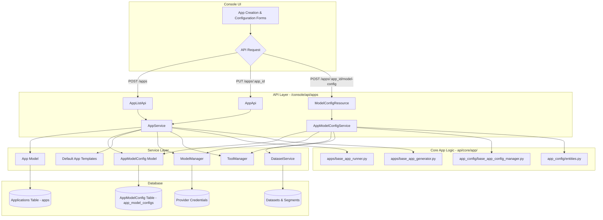

# Application Management

## 1. Feature Overview

The Application Management feature enables users to create, configure, deploy, and monitor various types of AI applications. It supports different application modes such as Chatbots (basic, advanced, agent-based), Completion applications, and Workflow Orchestrators. Users can define application behavior through model settings, prompt templates, linked datasets, and other configurable features.

## 2. Architecture Diagram



**Diagram Explanation:**

*   **Console UI:** Users interact with forms to create and configure applications.
*   **API Layer:** RESTful endpoints (primarily under `/console/api/apps`) receive requests from the UI.
    *   `AppListApi` handles creation and listing of apps.
    *   `AppApi` handles detail retrieval, updates, and deletion of specific apps.
    *   `ModelConfigResource` handles updates to the detailed model configuration of an app.
*   **Service Layer:**
    *   `AppService`: Core service for application lifecycle management (CRUD), uses default templates for new apps, and interacts with `ModelManager` to select appropriate LLMs.
    *   `AppModelConfigService`: Manages the detailed configuration (`AppModelConfig`) of an application, including model parameters, prompt templates, dataset linking, and agent tool settings. It validates configurations and interacts with `ModelManager` and `DatasetService`.
*   **Core App Logic (`api/core/app/`):**
    *   `base_app_runner.py`: Contains logic for running applications, including prompt generation, context management, and interaction with LLMs.
    *   `base_app_generator.py`: Handles input preparation and validation.
    *   `base_app_config_manager.py`: Converts raw configuration data into structured Pydantic entities.
    *   `entities.py`: Defines Pydantic models for app configurations.
*   **Database:**
    *   `Applications Table (apps)`: Stores core application information (name, mode, owner, etc.).
    *   `AppModelConfig Table (app_model_configs)`: Stores detailed configurations for each app.
    *   Other tables store provider credentials, dataset information, etc.

## 3. Related Modules

| Path                                               | Role                                                                 | Major Classes/Functions                                                                                                     |
| -------------------------------------------------- | -------------------------------------------------------------------- | --------------------------------------------------------------------------------------------------------------------------- |
| `api/services/app_service.py`                      | Core application lifecycle (CRUD), default template management.        | `AppService`, `create_app`, `update_app`, `delete_app`, `get_paginate_apps`                                                 |
| `api/services/app_model_config_service.py`         | Manages detailed application configurations.                         | `AppModelConfigService`, `validate_configuration` (Note: This service is implicitly used by `ModelConfigResource`)            |
| `api/controllers/console/app/app.py`               | Console API endpoints for app CRUD and general settings.               | `AppListApi`, `AppApi`, `AppCopyApi`, `AppExportApi`                                                                        |
| `api/controllers/console/app/model_config.py`      | Console API endpoint for updating detailed app model configurations.   | `ModelConfigResource`                                                                                                       |
| `api/models/model.py`                              | Database models for applications and their configurations.             | `App` (SQLAlchemy model), `AppModelConfig` (SQLAlchemy model), `AppMode` (Enum)                                           |
| `api/core/app/apps/base_app_runner.py`             | Base logic for running applications and interacting with LLMs.         | `AppRunner`, `organize_prompt_messages`, `_handle_invoke_result`                                                            |
| `api/core/app/apps/base_app_generator.py`          | Base logic for preparing and validating application inputs.            | `BaseAppGenerator`, `_prepare_user_inputs`, `_validate_inputs`                                                              |
| `api/core/app/app_config/base_app_config_manager.py` | Converts raw configuration data into structured Pydantic entities.     | `BaseAppConfigManager`, `convert_features`                                                                                  |
| `api/core/app/app_config/entities.py`              | Pydantic models for various application configuration structures.      | `AppConfig`, `ModelConfigEntity`, `PromptTemplateEntity`, `VariableEntity`, `DatasetEntity`, `EasyUIBasedAppConfig`         |
| `constants/model_template.py`                      | Contains default templates for different application modes.            | `default_app_templates`                                                                                                     |

## 4. Data Flow

### a. Application Creation

1.  **Input:** User provides application name, mode (e.g., "chat", "completion"), and icon via the Console UI.
2.  **API Request:** The UI sends a `POST` request to `/console/api/apps`.
3.  **Controller Processing:**
    *   `api/controllers/console/app/app.py -> AppListApi.post()` receives the request.
    *   It verifies user permissions (must be editor, admin, or owner).
4.  **Service Layer Processing:**
    *   `AppListApi` calls `api/services/app_service.py -> AppService.create_app()`.
    *   `AppService.create_app()`:
        *   Selects a default application template based on the chosen `mode` from `constants/model_template.py`.
        *   Initializes an `App` database model instance with the provided name, icon, mode, tenant ID, and creator ID.
        *   Retrieves a default LLM model configuration using `ModelManager` (considering tenant's defaults or system defaults).
        *   Creates an associated `AppModelConfig` database model instance, populating it with the default model settings (e.g., LLM provider, model name, parameters) and features (e.g., pre-prompt, agent settings if applicable) from the template.
        *   If WebApp authentication is enabled via system features, it updates the app's access mode to "private" by default using `EnterpriseService.WebAppAuth`.
        *   Commits the new `App` and `AppModelConfig` records to the database.
        *   Dispatches an `app_was_created` event.
5.  **API Response:** The `AppListApi` returns the details of the newly created application (marshalled into `app_detail_fields`) with a 201 status code.
6.  **Output:** A new application record and its default configuration are stored in the database. The UI typically navigates to the application's configuration page.

### b. Updating Application Model Configuration

1.  **Input:** User modifies settings in the "Prompt Engineering" or "Model Settings" section of an application in the Console UI (e.g., changes the LLM, updates the pre-prompt, configures tools for an agent).
2.  **API Request:** The UI sends a `POST` request to `/console/api/apps/<app_id>/model-config`.
3.  **Controller Processing:**
    *   `api/controllers/console/app/model_config.py -> ModelConfigResource.post()` receives the request.
    *   It uses the `@get_app_model` decorator to fetch the `App` instance.
4.  **Service Layer Processing:**
    *   `ModelConfigResource` calls `AppModelConfigService.validate_configuration()` (implicitly, by structuring the data and using Pydantic models defined in `api/core/app/app_config/entities.py` which are populated/validated by the service layer or controller).
    *   A new `AppModelConfig` instance is created.
    *   If the app is an agent (`app_model.mode == AppMode.AGENT_CHAT.value` or `app_model.is_agent`), it handles decryption of existing tool parameters and encryption of new/updated tool parameters using `ToolManager` and `ToolParameterConfigurationManager`. This ensures sensitive tool credentials are not stored in plain text.
    *   The new `AppModelConfig` is saved to the database, and the `app_model_config_id` in the `App` record is updated to point to this new configuration.
    *   Dispatches an `app_model_config_was_updated` event.
5.  **API Response:** Returns a success message.
6.  **Output:** The application's configuration is updated in the database. Subsequent runs of the application will use these new settings.

## 5. Extension Points

*   **Adding a New Application Mode:**
    1.  Define a new mode string in `api/models/model.py -> AppMode` enum.
    2.  Add a corresponding default template in `constants/model_template.py -> default_app_templates`. This template should define the initial `App` and `AppModelConfig` settings.
    3.  Update `ALLOW_CREATE_APP_MODES` in `api/controllers/console/app/app.py` if the new mode should be creatable via the UI.
    4.  Implement specific runner/generator logic if the new mode behaves significantly differently from existing modes (e.g., by creating new classes in `api/core/app/apps/` that might inherit from `BaseAppRunner` or `BaseAppGenerator`).
    5.  Update any UI components to recognize and handle the new mode.
*   **Adding New Configuration Features (e.g., a new toggle or setting):**
    1.  Add the new field to the `AppModelConfig` SQLAlchemy model in `api/models/model.py`.
    2.  Update the corresponding Pydantic entities in `api/core/app/app_config/entities.py` (e.g., within `AppAdditionalFeatures` or directly in `EasyUIBasedAppConfig`).
    3.  Modify `api/core/app/app_config/base_app_config_manager.py` (or create a new specific feature manager) to handle the conversion of this new feature from/to the `AppModelConfig`'s storage format (often JSON).
    4.  Update `AppModelConfigService` (or related logic in `ModelConfigResource`) to validate and process the new feature.
    5.  Update the UI to include controls for the new feature.
*   **Integrating a New LLM Provider or Model:**
    1.  This is primarily handled by the Model Management feature. Once a model is available through `ModelManager`, it can be selected in the application's model configuration.
    2.  Ensure `AppRunner` and other core logic correctly handle any specific properties or behaviors of the new model/provider.
```
